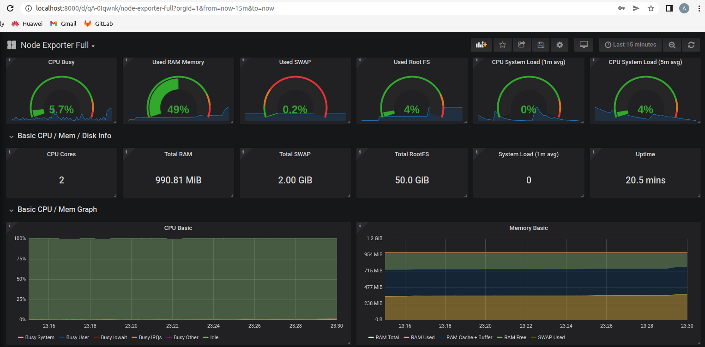
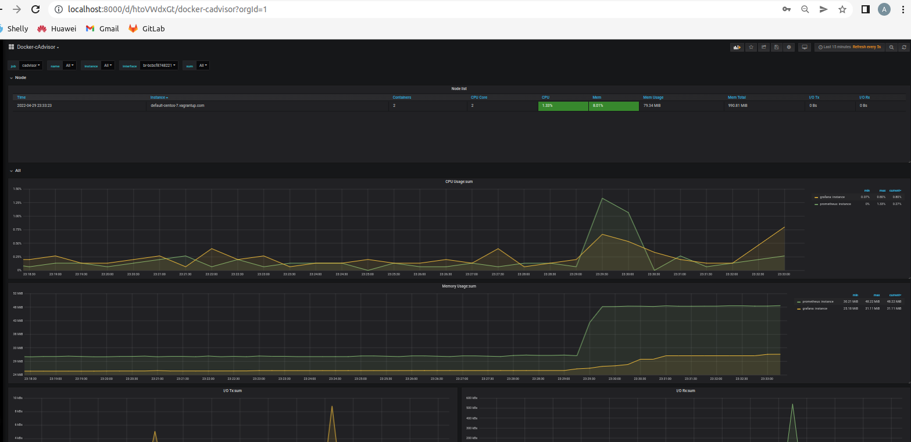

# Chef Prometheus Stack

## Prerequisites 
- install Chef Workstation [chef.io](https://www.chef.io/downloads/tools/workstation?os=debian)
- install Vagrant [vagrantup.com](https://www.vagrantup.com/downloads)
- install [VirtalBox](https://www.virtualbox.org/wiki/Linux_Downloads)

```commandline
andrius@terragrunt # chef --version
Chef Workstation version: 22.4.861
Chef InSpec version: 4.56.19
Chef CLI version: 5.6.1
Chef Habitat version: 1.6.420
Test Kitchen version: 3.2.2
Cookstyle version: 7.32.1
Chef Infra Client version: 17.10.0
```

### Cookbook
```commandline
# mkdir cookbooks
# cd cookbooks
# git clone https://github.com/hasnatapu/prometheus-stack-cookbook.git
```

I did changes in existing cookbook:
- add portforward for grafana in `kitchen.yaml`
- add cadvisor grafana dashboard template [number 13946](https://grafana.com/grafana/dashboards/13946)
- change host port to 8000 

```commandline
git diff
diff --git a/kitchen.yml b/kitchen.yml
index 6f61a82..66b1169 100644
--- a/kitchen.yml
+++ b/kitchen.yml
@@ -10,6 +10,9 @@ verifier:
 
 platforms:
   - name: centos-7
+    driver_config:
+      network:
+        - [ "forwarded_port", { guest: 8000, host: 8000 } ]
 
 suites:
   - name: default
diff --git a/recipes/grafana.rb b/recipes/grafana.rb
index 5d70c81..e5b68aa 100644
--- a/recipes/grafana.rb
+++ b/recipes/grafana.rb
@@ -40,6 +40,12 @@ template '/var/lib/grafana/dashboards/node-exporter-full_rev13.json' do
   notifies :run, 'execute[grafana-restart]', :delayed
 end
 
+template '/var/lib/grafana/dashboards/dashboard_cadvisor.json' do
+  source 'grafana/dashboard_cadvisor.erb'
+  mode '0755'
+  notifies :run, 'execute[grafana-restart]', :delayed
+end
+
 docker_image "grafana" do
   repo 'grafana/grafana'
   tag '6.1.6'
@@ -52,7 +58,7 @@ docker_container 'grafana' do
   action :run
   restart_policy 'always'
   network_mode 'net1'
-  port '3000:3000'
-  env ['GF_SECURITY_ADMIN_PASSWORD=secret'] 
+  port '8000:3000'
+  env ['GF_SECURITY_ADMIN_PASSWORD=supersecret'] 
   volumes ['/etc/grafana/provisioning:/etc/grafana/provisioning','/var/lib/grafana/dashboards:/var/lib/grafana/dashboards']
-end
\ No newline at end of file
+end
diff --git a/templates/grafana/dashoard_cadvisor.erb b/templates/grafana/dashoard_cadvisor.erb
deleted file mode 100644
index e69de29..0000000
```

### Run kitchen 
Output for [kitchen converge](kitchen_converge.txt)
this will download centos7 platform for vbox, spin vagrant instance 

```commandline
andrius@terragrunt prometheus-stack-cookbook (master)# kitchen list
Instance          Driver   Provisioner  Verifier  Transport  Last Action  Last Error
default-centos-7  Vagrant  ChefSolo     Inspec    Ssh        Converged    <None>

andrius@terragrunt prometheus-stack-cookbook (master)# kitchen login
Last login: Fri Apr 29 20:10:12 2022 from 10.0.2.2

This system is built by the Bento project by Chef Software
More information can be found at https://github.com/chef/bento

[vagrant@default-centos-7 ~]$ sudo docker ps 
CONTAINER ID   IMAGE                    COMMAND                  CREATED          STATUS          PORTS                    NAMES
de02d316a629   grafana/grafana:6.1.6    "/run.sh"                12 minutes ago   Up 12 minutes   0.0.0.0:8000->3000/tcp   grafana
cadcc3f4feae   prom/prometheus:v2.9.2   "/bin/prometheus --c…"   13 minutes ago   Up 12 minutes   0.0.0.0:9090->9090/tcp   prometheus


[vagrant@default-centos-7 ~]$ sudo netstat -tnlup
Active Internet connections (only servers)
Proto Recv-Q Send-Q Local Address           Foreign Address         State       PID/Program name    
tcp        0      0 0.0.0.0:22              0.0.0.0:*               LISTEN      843/sshd            
tcp        0      0 127.0.0.1:25            0.0.0.0:*               LISTEN      1148/master         
tcp        0      0 0.0.0.0:8000            0.0.0.0:*               LISTEN      4423/docker-proxy   
tcp        0      0 0.0.0.0:9090            0.0.0.0:*               LISTEN      4286/docker-proxy   
tcp6       0      0 :::9100                 :::*                    LISTEN      4115/node_exporter  
tcp6       0      0 :::8080                 :::*                    LISTEN      4154/cadvisor       
tcp6       0      0 :::22                   :::*                    LISTEN      843/sshd            
tcp6       0      0 ::1:25                  :::*                    LISTEN      1148/master         
udp        0      0 0.0.0.0:68              0.0.0.0:*                           2716/dhclient       
udp        0      0 127.0.0.1:323           0.0.0.0:*                           522/chronyd         
udp6       0      0 ::1:323                 :::*                                522/chronyd 


```
login to localhost:8000 for grafana 




